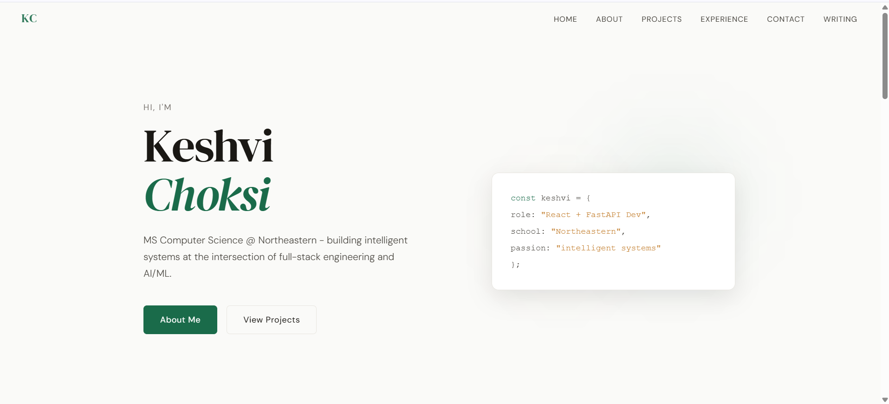

# Keshvi Choksi – Personal Homepage



## Author

**Keshvi Choksi**
MS Computer Science, Northeastern University
📧 keshvibhavinchoksi@gmail.com
🔗 [linkedin.com/in/keshvi-choksi](https://linkedin.com/in/keshvi-choksi/)

## Class Link

CS 5610 Web Development - Prof. John Alexis Guerra Gomez - Northeastern University

## Project Objective

A personal homepage built with vanilla HTML5, CSS3, and ES6+ JavaScript (no frameworks, no jQuery). The site showcases Keshvi's background, skills, projects, and experience in AI/ML and full-stack engineering. It features a typewriter animation on the hero code card as a creative differentiator, and animated skill progress bars on the About page.

## Pages

| File                      | URL                        | Description                                                 |
| ------------------------- | -------------------------- | ----------------------------------------------------------- |
| `index.html`              | `/`                        | Main homepage – hero, skills, projects, experience, contact |
| `pages/about.html`        | `/pages/about.html`        | About – education, interests, animated skill bars           |
| `pages/ai-generated.html` | `/pages/ai-generated.html` | AI-generated essay on RAG systems                           |

## Creative Feature

**Typewriter role animator** (`js/typewriter.js`): The hero code card cycles through Keshvi's different roles (AI/ML, RAG Pipeline Builder, MLOps Engineer, etc.) with a realistic typewriter effect — typing out, pausing, deleting, and moving to the next role. Built with `setTimeout` and `requestAnimationFrame`, no libraries.

## Tech Stack

- HTML5, CSS3, ES6+ (vanilla only)
- CSS Grid + Flexbox for layout
- CSS custom properties (variables) for theming
- ES6 modules (`type="module"`)
- IntersectionObserver API for scroll-triggered animations
- Google Fonts (DM Serif Display + DM Sans)

## Instructions to Build

```bash
# 1. Clone the repository
git clone https://github.com/keshvichoksi/homepage.git
cd homepage

# 2. Install dev dependencies (Prettier, ESLint)
npm install

# 3. Lint JS files
npm run lint

# 4. Format all files with Prettier
npm run format

# 5. Open in browser (no build step needed)
open index.html
# or use a local server:
npx serve .
```

## Deployment

Deployed via GitHub Pages at: `https://keshvichoksi.github.io/homepage`

## W3C Validation

All pages validated at [https://validator.w3.org](https://validator.w3.org) — no errors.

## Demo Video
https://www.youtube.com/watch?v=28LdVEsIMog


## GenAI Usage

**Models used:** Claude Sonnet 4 (Anthropic)

**How it was used:**

- The essay on `pages/ai-generated.html` ("Why Retrieval-Augmented Generation Is the Future of Enterprise AI") was fully generated by Claude based on the prompt: _"Write a professional essay about RAG systems for an AI/ML engineer's personal homepage. Focus on enterprise applications, architecture, and future directions. ~500 words."_
- Claude was also used to help scaffold the initial HTML structure and suggest CSS variable naming conventions.
- All JavaScript logic (typewriter, skill bars, nav scroll) was written and reviewed manually.

**Prompt used for essay:**

> "Write a professional essay about why RAG (Retrieval-Augmented Generation) is important for enterprise AI. Include sections on the core problem, architecture, enterprise benefits, and what comes next. Tone: technical but accessible. Length: ~500 words. Include a memorable closing quote."

## File Structure

```
keshvi-homepage/
├── index.html
├── pages/
│   ├── about.html
│   └── ai-generated.html
├── css/
│   └── style.css
├── js/
│   ├── main.js
│   ├── nav.js
│   ├── skillBars.js
│   └── typewriter.js
├── images/
│   └── favicon.svg
|   └──screenshot.png
├── package.json
├── .eslint.config.js
├── .prettierrc
├── LICENSE
└── README.md
```

## License

[MIT](LICENSE)
